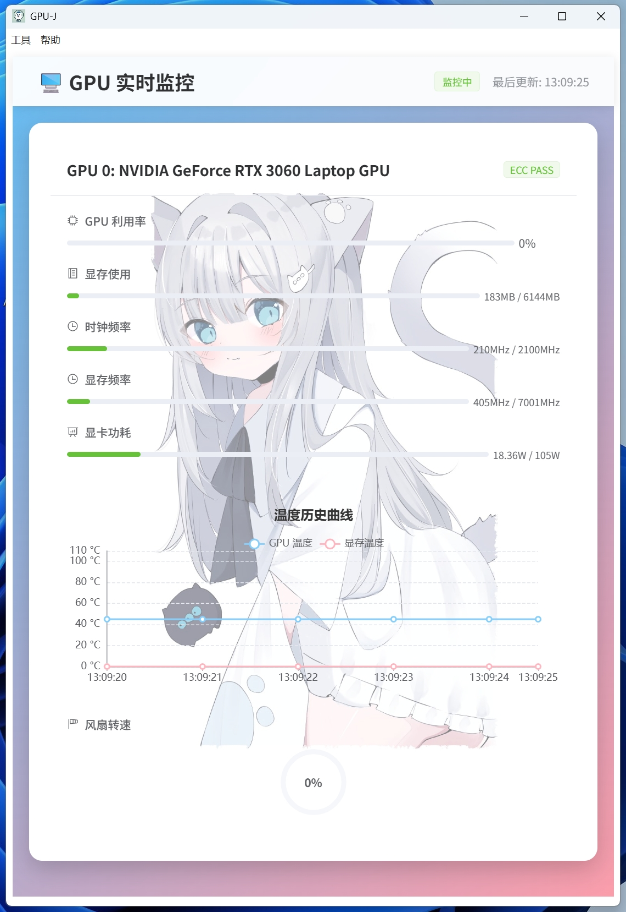

# GPU-J

Software for real-time monitoring of GPU status and GPU ECC errors.

## ✨ Core Features

- **Multi-GPU Support**: Monitor multiple graphics cards simultaneously
- **Real-time Monitoring Metrics**:
  - 🎯 GPU Utilization
  - 💾 VRAM Usage
  - ⏰ Core Clock Frequency
  - 🚀 Memory Frequency
  - ⚡ GPU Power Consumption
  - 🌡️ GPU Temperature
  - 🔥 Memory Temperature
  - 🌬️ Fan Speed
- **ECC Error Detection**: Real-time monitoring and alerting for ECC memory errors


## ✨ 核心功能

- **多GPU支持**：同时监控多张显卡状态
- **实时监控指标**：
  - 🎯 GPU利用率
  - 💾 显存使用情况
  - ⏰ 核心时钟频率
  - 🚀 显存频率
  - ⚡ 显卡功耗
  - 🌡️ 显卡温度
  - 🔥 显存温度
  - 🌬️ 风扇转速
- **ECC错误检测**：实时监测并告警ECC内存错误




# Windows 用户
点击下载 **[Windows_GPU-J.Setup.0.0.1.exe](https://github.com/sertreet/GPU-J/releases/download/v0.0.1/Windows_GPU-J.Setup.0.0.1.exe)**  安装即可使用

# Linux用户
## 1️⃣ .deb 安装包
点击下载 **[Linux_gpuj_0.0.1_amd64.deb](https://github.com/sertreet/GPU-J/releases/download/v0.0.1/Linux_gpuj_0.0.1_amd64.deb)**

打开终端输入命令安装：
```bash
$ sudo dpkg -i Linux_gpuj_0.0.1_amd64.deb
```
然后在桌面环境上找到 **GPU-J** 软件双击点开即可运行。

卸载软件：
```bash
$ sudo apt remove gpuj
```

## 2️⃣ .AppImage 便携包
点击下载 **[Linux_GPU-J-0.0.1.AppImage](https://github.com/sertreet/GPU-J/releases/download/v0.0.1/Linux_GPU-J-0.0.1.AppImage)**

打开终端输入命令，增加可执行权限：
```bash
$ chmod +x Linux_GPU-J-0.0.1.AppImage
```

输入命令，直接运行：
```bash
$ ./Linux_GPU-J-0.0.1.AppImage
```

# 从源码开始构建

## Project Setup

### Install

```bash
$ npm install
```

### Development

```bash
$ npm run dev
```

### Build

```bash
# For windows
$ npm run build:win

# For macOS
$ npm run build:mac

# For Linux
$ npm run build:linux
```

